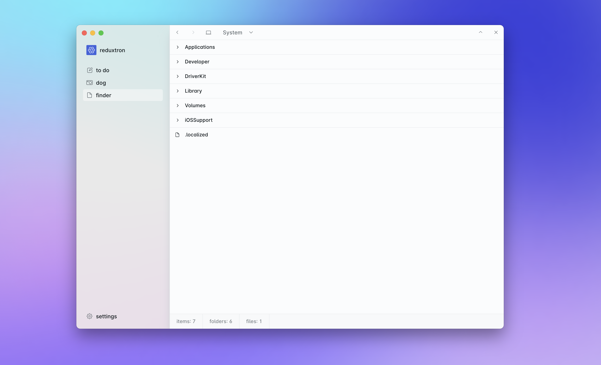

<picture>
  <source media="(prefers-color-scheme: dark)" srcset="./assets/readme-hero-dark.png"/>
  <source media="(prefers-color-scheme: light)" srcset="./assets/readme-hero-light.png"/>
  
</picture>

> what if we have a single redux store on electron’s main process, and have it accessible on every piece of the app.

### features

1. frontend framework agnostic, use whatever you like, even vanilla js.
1. global state, single-source of truth for all state you want to share.
1. making the app state as predictable as any redux implementation (actions, devtools, etc)
1. frontend, tray, main node process dispatch type-defined actions
1. all above mentioned pieces receive the new state back thru redux subscriptions
1. single place to write redux middleware with full node.js access (file-system, fetch, db, etc)
1. easy way to persist and retrieve state (reading/writing to a json file, saving to a local db, fetching/posting to external api, etc)
1. ipc performance, no api layer, without any manual ipc messaging/handling to write
1. follows latest electron safety recommendations ([`sandbox: true`](https://www.electronjs.org/docs/latest/tutorial/sandbox) + [`nodeIntegration: false`](https://www.electronjs.org/docs/latest/tutorial/security#isolation-for-untrusted-content) + [`contextIsolation: true`](https://www.electronjs.org/docs/latest/tutorial/context-isolation))

### repo organization

this is a monorepo containing all of the related code for:

1. the [reduxtron library](./packages/reduxtron)
1. the [reduxtorn demo app](./packages/demo)
1. the reduxtron boilerplates:

- [boilerplate-react](./packages/boilerplate-react)
- [boilerplate-svelte](./packages/boilerplate-svelte)
- [boilerplate-vue](./packages/boilerplate-vue)

### the `reduxtron` library

> set of utilities available on [npm](npmjs.com/package/reduxtron) to plug into existing electron projects

on your terminal

```bash
# install as a regular dependency
npm i reduxtron
```

create your redux _reducers_ somewhere where both main and renderer processes can import
(for example purposes we’ll be considering a `shared/reducers` file).
remember to export your `State` and `Action` types

initialize your redux _store_ on the main process (we’ll be considering a `main/store` for this)

add the following lines onto your `main` process entry file:

```ts
import { app, ipcMain } from "electron";
import { mainReduxBridge } from "reduxtron/main";
import { store } from "shared/store";

const { unsubscribe } = mainReduxBridge(ipcMain, store);

app.on("quit", unsubscribe);
```

and this onto your `preload` entry file:

```ts
import { contextBridge, ipcRenderer } from "electron";
import { preloadReduxBridge } from "reduxtron/preload";
import type { State, Action } from "shared/reducers";

const { handlers } = preloadReduxBridge<State, Action>(ipcRenderer);

contextBridge.exposeInMainWorld("reduxtron", handlers);
```

this will populate a `reduxtron` object on your frontend runtime containing the 3 main redux store functions (inside the `global`/`window`/`globalThis` object):

```ts
// typical redux getState function, have the State return type defined as return
global.reduxtron.getState(): State

// typical redux dispatch function, have the Action type defined as parameter
global.reduxtron.dispatch(action: Action): void

// receives a callback that get’s called on each store update
// returns a `unsubscribe` function, you can optionally call it when closing window or when you don’t want to listen for changes anymore.
global.reduxtron.subscribe(callback: ((newState: State) => void) => () => void)
```

ps: the `reduxtron` key here is just an example, you can use any object key you prefer

### demo app

> a [ever `wip` demo app](./packages/demo) to show off some of the features/patterns this approach enables



```
git clone git@github.com:vitordino/reduxtron.git # clone this repo
cd reduxtron # change directory to inside the repo
npm i # install dependencies
turbo demo # start demo app on development mode
```

the demo contains some nice (wip) features:

1. naïve persistance (writing to a json file on every state change + reading it on initialization)
1. [_zustand_](https://github.com/pmndrs/zustand)-based store and selectors (to prevent unnecessary rerenders)
1. _[swr](https://swr.vercel.app/)-like_ reducer to store data from different sources (currently http + file-system)
1. *micro-apps* inside the demo:
  - a simple to do list with small additions (eg.: external windows to add items backed by different frontend frameworks)
  - a dog breed picker (to show off integration with http APIs)
  - a finder-like file explorer
1. all the above *micro-apps* also have a native tray interface, always up-to-date, reads from the same state and dispatches the same actions

### boilerplates

as aforementioned, this repo contains some (non-exhaustive, really simple) starters.

currently they are all based on [electron-vite](https://evite.netlify.app/), only implements a counter, with a single renderer window and tray to interact with.

### why redux?

> spoiler: i’m not a die hard fan of redux nowadays

redux definitely helped a bunch of the early-mid 2010’s web applications. back then, we didn’t had that much nicer APIs to handle a bunch of state for us.

we now have way more tooling for the most common (and maybe worse) use-cases for redux:

- data-fetching (and caching):
  - client-only: [_swr_](https://swr.vercel.app/), [_react-query_](https://tanstack.com/query/v3/), [_react-router_ loaders](https://reactrouter.com/en/main/route/loader)
  - or even integrated server-side solutions (like [_react_ server components](https://react.dev/blog/2023/03/22/react-labs-what-we-have-been-working-on-march-2023#react-server-components), [_remix_](https://remix.run/)

- global app state:
  - react context (sometimes bad, but built-in and stable)
  - [_zustand_](https://github.com/pmndrs/zustand) and hundreds of other "lighter" state-management libraries.
  - local databases (eg.: using a [sqlite](https://sqlite.org/) alongside the electron app)

---

so why redux was chosen?

1. framework agnostic, it’s just javascript™ (so it can run on node, browser, or any other js runtime needed) — compared to ([_recoil_](https://github.com/facebookexperimental/Recoil), [pinia](https://github.com/vuejs/pinia))
1. single store (compared to [_mobx_](https://github.com/mobxjs/mobx), [_xstate_](https://github.com/statelyai/xstate) and others)
1. single "update" function, with a single signature (so it’s trivial to register on the `preload` and have end-to-end type-safety)
1. single "subscribe" function to all the state — same as above reasons

### related projects and inspiration

while developing this repo, i also searched for what was out there™ in this regard, and was happy to see i wasn’t the only thinking on these crazy thoughts.

- [klarna/electron-redux](https://github.com/klarna/electron-redux)
  - belongs to a major company, high visibility
  - started around 2016, but stopped being maintained around mid-2020
  - had another redux store on the frontend, and sync between them a bit more complex than i like.
  - incompatible with [electron versions >= 14](https://github.com/klarna/electron-redux/issues/317)

- [zoubingwu/electron-shared-state](https://github.com/zoubingwu/electron-shared-state)
  - individual-led, still relatively maintained
  - no redux, single function export
  - doesn’t respect electron safety recommendations (needs `nodeIntegration: true` + `contextIsolation: false`)
